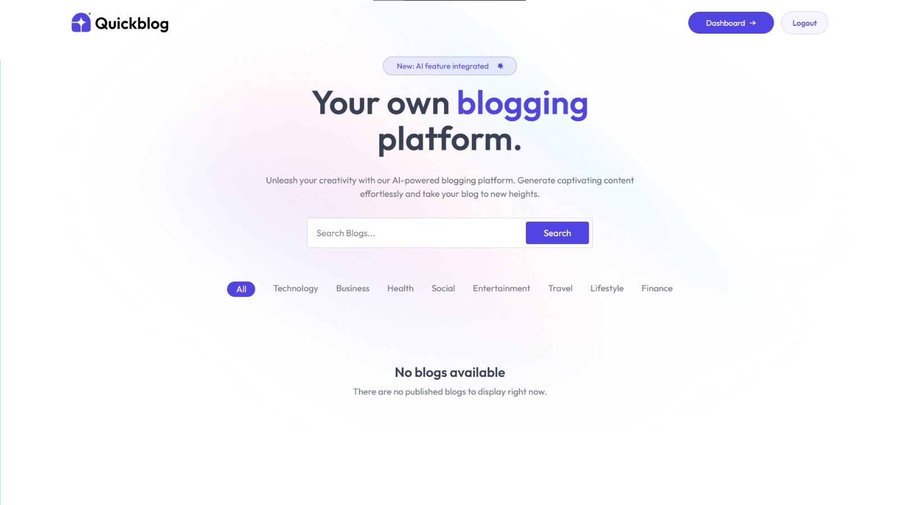
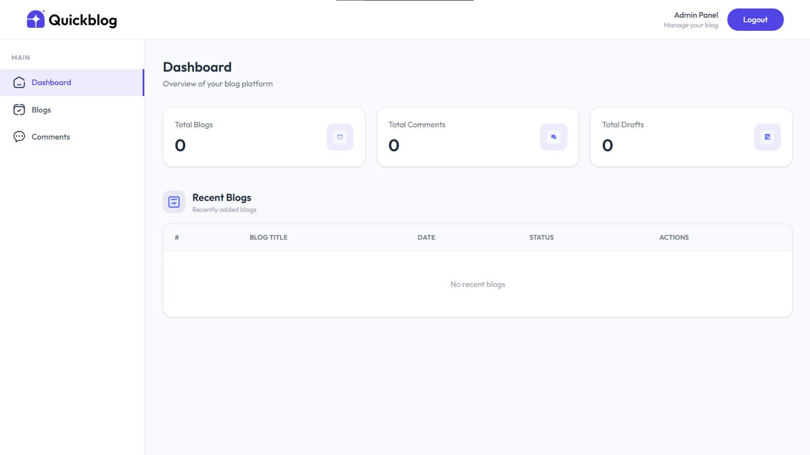

# QuickBlog --- AI-Powered Blogging Platform

A full-stack blogging platform built with the MERN stack, featuring
AI-assisted writing, secure authentication, rich-text editing, image
uploads, and an admin dashboard.

> **Project status:** Core blogging, authentication, AI-writing, and
> moderation features are implemented. Redis caching and background-job
> processing are planned future enhancements, not current features.

## ✨ Features

### ✍️ Blogging and content creation

-   Create, edit, delete, and manage blog posts.
-   Save posts as drafts or publish them.
-   Write and format content with the Quill rich-text editor.
-   Upload blog images through ImageKit.
-   Organize posts with categories.
-   Generate blog content with the Groq API.

### 🔐 Authentication and account management

-   JWT-based authentication using cookies.
-   Google OAuth sign-in.
-   Email OTP verification during registration.
-   OTP-based password recovery.
-   Protected routes and role-based access control.
-   User profile management, including profile image updates.
-   Email-change verification and account-management flows.

### 🛡️ Administration and moderation

-   Admin dashboard with platform statistics.
-   Manage blog posts.
-   Review and moderate comments.
-   Protected admin functionality.

### 💬 Comments and user experience

-   Comment management and moderation workflows.
-   Personal dashboard for managing your own blogs.
-   Responsive interface with loading states, notifications, and
    animated interactions.

## Tech Stack

| Layer | Technologies |
| --- | --- |
| Frontend | React 19, Vite, React Router, Redux Toolkit, Tailwind CSS, Motion, Quill |
| Backend | Node.js, Express 5, Mongoose, JWT, Multer |
| Services | MongoDB, ImageKit, Google OAuth, Groq, Resend |
| Tooling | ESLint, Nodemon, Axios |

## Project Structure

```text
QuickBlog/
├── client/
│   ├── public/                 # Static files and icons
│   ├── src/
│   │   ├── api/                # Axios client configuration
│   │   ├── assets/             # Images, icons, and shared data
│   │   ├── components/         # Shared, navigation, admin, and UI components
│   │   ├── context/            # Theme context
│   │   ├── layout/             # Main, user, and admin layouts
│   │   ├── pages/              # Public, auth, user, and admin screens
│   │   ├── redux/              # Auth/blog slices and store
│   │   ├── routes/             # Protected route guards
│   │   ├── index.css
│   │   └── main.jsx            # Router and application entry point
│   ├── package.json
│   └── vite.config.js
├── server/
│   ├── configs/                # Database and third-party service clients
│   ├── controllers/            # Request handlers
│   ├── middlewares/            # Authentication and file upload middleware
│   ├── models/                 # Mongoose schemas
│   ├── routes/                 # Admin, blog, and user API routes
│   ├── services/               # Auth, Google OAuth, and OTP services
│   ├── app.js                  # Express app and server bootstrap
│   └── package.json
└── README.md
```

## Getting Started

### Prerequisites

- Node.js 18 or newer
- npm
- A MongoDB database
- Accounts or API credentials for the integrations you plan to use: ImageKit, Google OAuth, Groq, and Resend

### 1. Clone the repository

```bash
git clone https://github.com/Ghoshal12345/QuickBlog--AI-Powered-Blogging-Platform.git
cd QuickBlog--AI-Powered-Blogging-Platform
```

### 2. Install dependencies

```bash
cd server
npm install

cd ../client
npm install
```

### 3. Configure the server

Create `server/.env`:

```env
PORT=8005
CLIENT_URL=http://localhost:5173
MONGO_URI=your_mongodb_connection_string
JWT_SECRET_KEY=replace_with_a_long_random_secret

IMAGEKIT_PRIVATE_KEY=your_imagekit_private_key
GROQ_API_KEY=your_groq_api_key
RESEND_API_KEY=your_resend_api_key
GOOGLE_CLIENT_ID=your_google_client_id
```

### 4. Configure the client

Create `client/.env`:

```env
VITE_BASE_URL=http://localhost:8005
VITE_GOOGLE_CLIENT_ID=your_google_client_id
```

Keep both `.env` files private. Do not commit API keys, database credentials, or JWT secrets to GitHub.

### 5. Run the application

Start the API in one terminal:

```bash
cd server
npm run dev
```

Start the Vite development server in another:

```bash
cd client
npm run dev
```

The frontend is typically available at `http://localhost:5173`, and the API runs at `http://localhost:8005`.

## Available Scripts

### Client

```bash
npm run dev       # Start Vite in development mode
npm run build     # Create a production build
npm run preview   # Preview the production build locally
npm run lint      # Run ESLint
```

### Server

```bash
npm run dev       # Start the API with Nodemon
npm start         # Start the API with Node.js
```

## Main Routes

### Frontend

| Route | Purpose |
| --- | --- |
| `/` | Public home page and blog feed |
| `/blog/:id` | Read a blog post |
| `/login` | Sign in with email/password or Google |
| `/signup` | Create an account |
| `/forgot-password` | Start password recovery |
| `/user/profile` | View the signed-in user's profile |
| `/user/my-blogs` | Manage personal blog posts |
| `/user/add-blog` | Create a blog post |
| `/admin` | Admin dashboard |
| `/admin/blogs` | Manage blog posts |
| `/admin/comments` | Manage comments |

### API

The Express API is grouped under:

- `/api/user`
- `/api/blog`
- `/api/admin`

## Screenshots

The application includes public reading views, authentication screens, an author workspace, and an admin dashboard. Add captured images to `docs/screenshots/` and reference them here as the project evolves:

```markdown


```

For the cleanest GitHub presentation, capture the home page, blog detail page, author editor, and admin dashboard after configuring the local services.

## Security Notes

- Authentication uses HTTP cookies and JWT session validation.
- CORS is configured through `CLIENT_URL`.
- Keep all server credentials in environment variables.
- Never expose `IMAGEKIT_PRIVATE_KEY`, `JWT_SECRET_KEY`, `MONGO_URI`, or provider API keys in frontend code.

## Contributing

1. Create a feature branch.
2. Make focused changes and run the client lint/build checks.
3. Open a pull request with a clear description and screenshots for UI changes.

## License

No license has been declared for this repository yet. Add a license file before publishing the project for reuse by others
